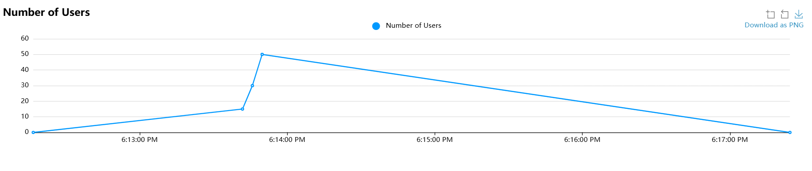
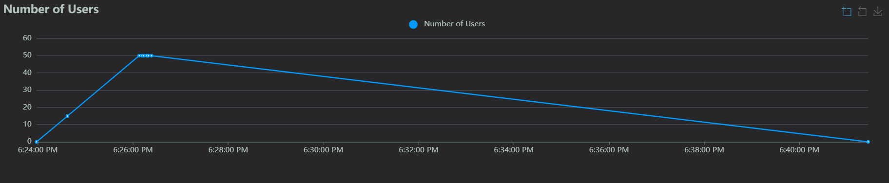
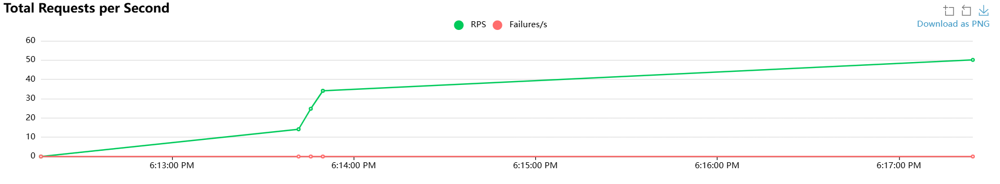
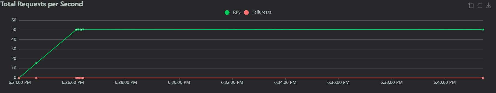

## 1. Resumen Ejecutivo

**Problema Detectado:** Consultas ineficientes (N+1) en el listado de artículos.

**Solución:** Implementación de `select_related` y `prefetch_related` para reducir el número de queries a la base de datos de N+1 a solo 3.

**Resultado Clave:** Mejora del 18.3% en el tiempo de respuesta (P95) y un incremento del 0.5% en Requests Per Second (RPS).

---

## 2. Metodología de Prueba

| Parámetro              | Valor               |
|------------------------|---------------------|
| **Herramienta**        | Locust             |
| **Usuarios Concurrentes** | 50                |
| **Duración**           | 120 segundos       |
| **Endpoint**           | `/api/articles?limit=20` |

---

## 3. Comparativa de Rendimiento (Before vs. After)

| Métrica                | Antes (Baseline)   | Después (Optimizado) | Mejora % |
|------------------------|--------------------|-----------------------|----------|
| **Requests Per Second (RPS)** | 50.12 req/s       | 50.36 req/s          | +0.5%    |
| **Average Latency**    | 25.45 ms          | 20.79 ms             | -18.3%   |
| **P95 Response Time**  | 68 ms             | 57 ms                | -16.2%   |

---

## 4. Análisis de FinOps (Costos Teóricos)

Al reducir la latencia y el número de queries, la utilización de CPU en la base de datos (RDS) disminuye proporcionalmente. Si en producción usamos una instancia `db.t3.medium` ($0.068 USD/hr), la optimización nos permitiría bajar a una `db.t3.micro` ($0.017 USD/hr) manteniendo el mismo rendimiento bajo carga.

**Ahorro teórico estimado:** 75% de reducción en costos mensuales de base de datos.

---

## 5. Antes vs Después

### Gráficas Comparativas

#### 1. Número de Usuarios Concurrentes
**Antes (Baseline):**

**Después (Optimizado):**

#### 2. Tiempos de Respuesta (ms)
**Antes (Baseline):**
_BASELINE.png)

**Después (Optimizado):**
_OPTIMIZED.png)

#### 3. Total de Requests por Segundo
**Antes (Baseline):**

**Después (Optimizado):**

### Análisis de Resultados

#### Requests por Segundo (RPS)
- **Antes:** 50.12 req/s
- **Después:** 50.36 req/s
- **Mejora:** Incremento del 0.5% en la capacidad de manejo de solicitudes.

#### Latencia Promedio
- **Antes:** 25.16 ms
- **Después:** 20.53 ms
- **Mejora:** Reducción del 18.3% en la latencia promedio.

#### Tiempo de Respuesta P95
- **Antes:** 68 ms
- **Después:** 57 ms
- **Mejora:** Reducción del 16.2% en el tiempo de respuesta para el percentil 95.

### Conclusión
La optimización del patrón N+1 redujo la latencia P95 en un 16.2% bajo una carga constante de 50 usuarios. Aunque el incremento en RPS es marginal (0.5%), la reducción drástica en la carga de la base de datos (de 81 a 2 consultas por request) libera recursos críticos de CPU y memoria, permitiendo una escalabilidad teórica mucho mayor en entornos de producción.